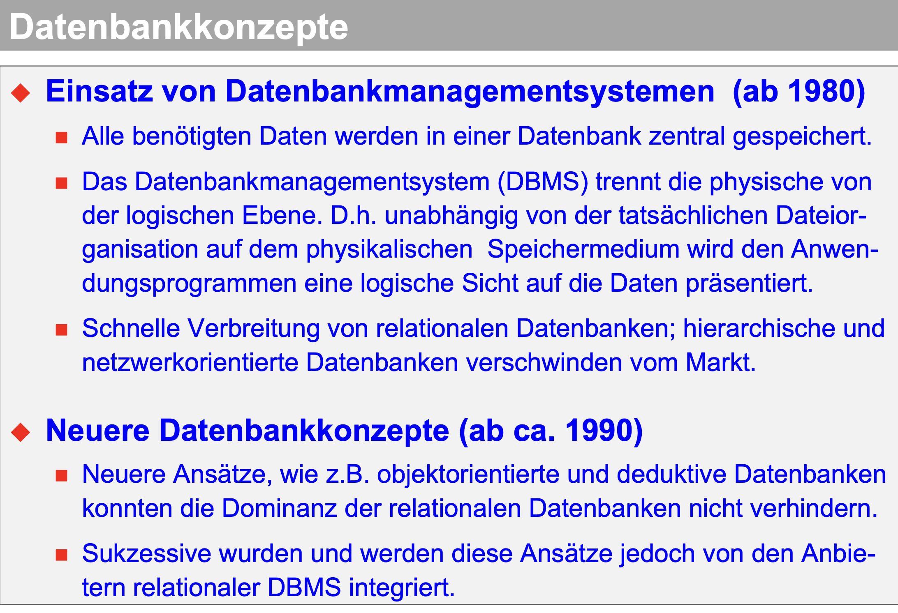
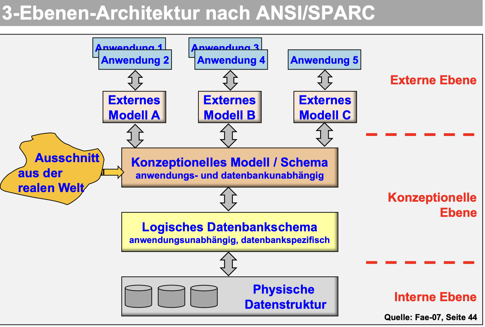
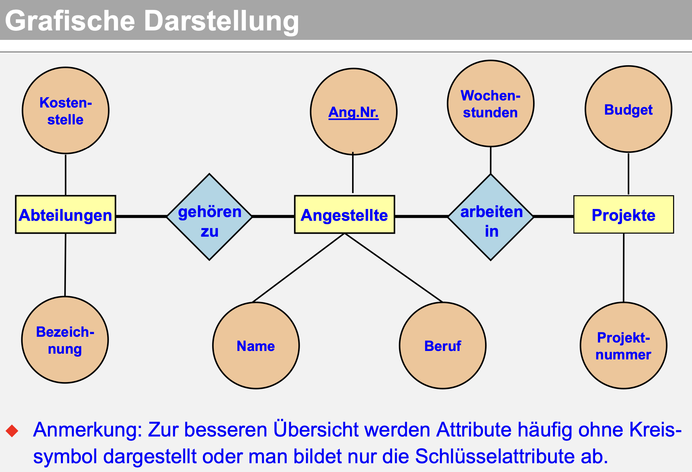

# Datenbanken

## Vorlesung 12.10.2023

### Informationen

- Ulrich Ehrhardt
- eh@infokom.info
- 0175/7232052

### Klassifikation von Daten

- Stammdaten: unveränderlich über längeren Zeitraum, Identifizierung
- Änderungsdaten: abwicklungsorientierte Daten lösen fallweise Änderung von Stammdaten aus
- Bestandsdaten: permanente Änderung, betriebliche Mengen- und Wertestruktur
- Bewegungsdaten: abwicklungsorientierte Daten lösen Änderung von Bestandsdaten aus (durch betriebliche
  Leistungsprozesse)

- Unstrukturierte Daten: kein festes Format, benötigt Intelligenz zur Verarbeitung
- Semistrukturierte Daten: vorgegebene Anordnung, jedoch nicht verbindlich
- Strukturierte Daten: fest vorgegebene Anordnung, wird systemseitig überwacht (Semantik muss beschrieben werden)

### Datenbank Vorteile:

- Vermeidung von Redundanz
- Verhinderung von Inkonsistenz
- Datensicherheit
- Integritätssicherung
- Datenschutz, besonders seit der DSGVO
- Synchronisation im Mehrbenutzerbetrieb

### Alte Datenmodelle (NICHT KA)

- Hierarchisches Datenmodell
- Netzwerkorientiertes Datenmodell
- Relationales Datenmodell (später wichtig)
- Objektorientiertes Datenmodell
- Objektrelationales Datenmodell
- Deduktives Datenmodell
- Semantisches Datenmodell (wichtig)

### Betrachtungsebene beim Datenbankentwurf

- Konzeptionelles Modell: Kapitel 2
- logisches Datenbankschema: Kapitel 3

BSP:

| Matrikelnummer | Vorname | Nachname  | PLZ   | Ort | Straße | Fach | Semester |
|----------------|---------|-----------|-------|-----|--------|------|----------|
| 100001         | Anton   | Müller    | 67256 | r   | 4      | INF  | 1        |
| 100002         | Jochen  | Schweizer | 49854 | t   | 5      | WI   | 3        |
| 999999         | Detlef  | k         | 34434 | t   | t      | INF2 | 6        |

Tabelle

- einwertig: jedes entity hat genau einen Wert aus einem Wertebereich (in einem Attribut/Spalte gibt es alle Werte nur
  einmal)

Einfaches ER-Modell bauen → Ziel einwertige Attribute, heißt ein Attribut kann nicht mehrere Werte haben

### Beziehungen zwischen Entitäten

Darstellung:

Es gibt auch "weak" entity's, das heißt diese existieren nur dann, wenn eine andere Entität ebenfalls davor bereits
existiert. Auch kann es zwischen zwei Entitätentypen mehrere Verbindungen geben.

Schlüssel von Beziehungen (Rauten): hat als Attribute Primärschlüssel von den beiden verbundenen Entitäten und andere
Attribute, sowie einen weiteren eigenen Primärschlüssel.

### Komplexität von binären Beziehungen

#### Notation nach Chen:

- 1:1 Beziehung: eine Entität hat höchstens eine Entität zugeordnet und umgekehrt
- 1:n Beziehung: eine Entität hat eine oder mehrere Entitäten zugeordnet, aber umgekehrt jeweils nur eine Entität
  zugeordnet
- n:1 Beziehung: 1:n Beziehung umgedreht
- n:m Beziehung: eine Entität kann beliebig viele Entitäten zugeordnet haben und ebenfalls auch umgekehrt

#### Min-Max Notation:

0 ≤ a ≤ b ≤ *
Schreibe auf: auf beiden Seiten der Entitätsverbindung je eine Min, Max Notation:
(0,1) → mindestens 0 maximal 1 Beziehung
(0,4) → mindestens 0 maximal 4 Beziehungen
(0,*) → mindestens 0 maximal beliebig viele Beziehungen
(1,*) → mindestens 1 maximal beliebig viele Beziehungen

