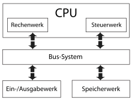
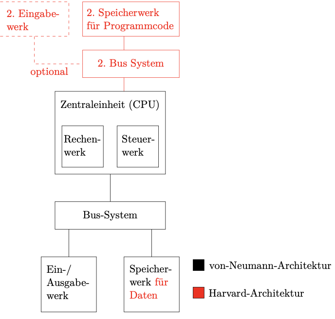
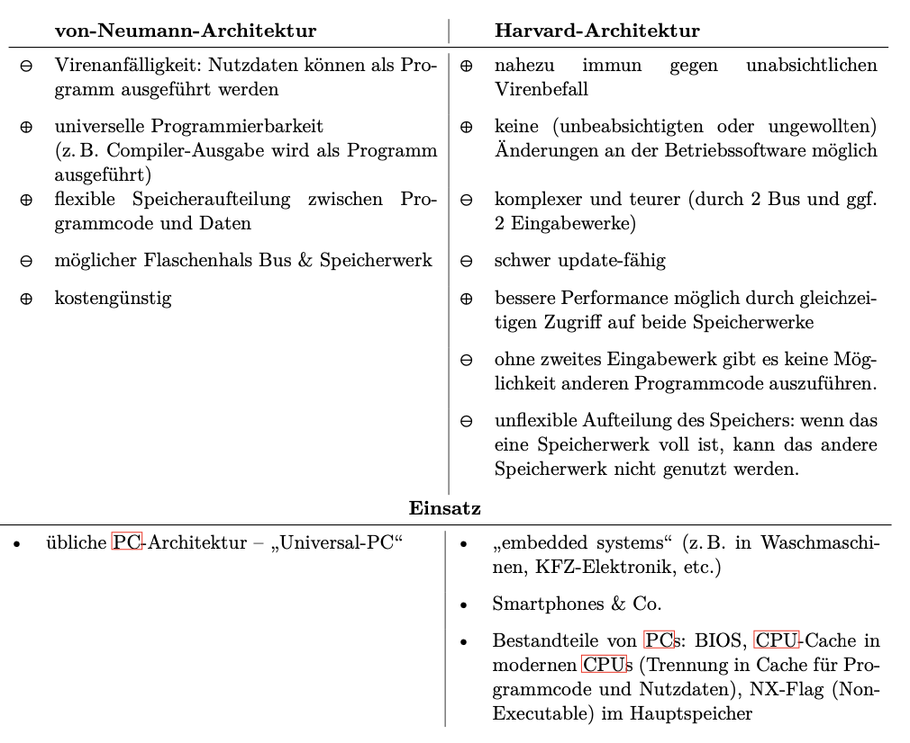

# Rechnerarchitektur

## Vorlesung 04.10.2023

### 0.0)  Intro

- Röthig, C560, 07219735883
- Rechnerarchitektur (Vorlesung) im Modul Technische Informatik 2
- weitere Vorlesungen: Betriebssysteme, systemnahes Programmieren
- Pl: Klausur (60min, ohne Hilfsmittel)

### 0.1) Motivation

Rechner: schneller, fehlerfreier, besseres Speichervermögen
Rechenmaschinen:

- Abakus (mechanisch, digital)
- Rechenschieber (mechanisch, analog)

### 0.2) Geschichte

(positive Sachen: fett geschrieben, negative Sachen: nicht fett geschrieben)

- ab 1940: **ZUSE** (Z1, Z2, Z2):
    + **Automatismus möglich**
    + hoher Platzbedarf
    + hohe Schaltzeit
    + hoher Energieverbrauch beim Schalten
    + hohe Wärmeentwicklung
    + hoher Verschleiss (Hitze und Mechanik)
    + teures Bauteil
    + hohe Geräuschentwicklung beim Schalten
- ab 1945: **ENIAC** Elektronenstrahlröhre als elektrischer Schalter (eigentlich ein analoger Verstärker, welcher mit
  nur 2 Verstärkungsfaktoren maximal und minimal betrieben wird)
    + **Automatismus möglich**
    + **kurze Schaltzeit**
    + mögliche Geräuschentwicklung durch "Netzbrummen" bei schlechter Lagerung der Röhre im Betrieb
    + ständiger hoher Energieverbrauch (Heizung)
    + hohe Wärmeentwicklung
    + hoher Verschleiss
    + hoher Platzbedarf
    + teures Bauteil
- ab 1960: **UNIVAC** Transistor als elektrischer Schaltung (eigentlich ebenfalls ein analoger Verstärker)
    + **geräuschlos** (Geräuschentwicklung ggf durch andere mechanische Bauteile, z. B. Lüfter, Festplatte, opt.
      Laufwerk)
    + **sehr geringer Energieverbrauch**
    + **geringere Wärmeentwicklung je Bauteil** (Hitze ist auf Vielzahl der Transistoren und hohe Packdichte
      zurückzuführen)
    + **fast kein Verschleiss**
    + **extrem wenig Platzverbrauch**
    + **sehr kurze Schaltzeit**
    + **extrem günstiges Bauteil**
    + unsere heutigen modernen Rechner arbeiten derzeit nahezu alle digital und elektronisch

### 1.0) von-Neumann Architektur

(FÜR KLAUSUR!)

- Zentraleinheit (CPU) besteht aus:
    + Rechenwerk (ALU): Rechnen mit Zahlen und Wahrheitswerten (Logik)
    + Steuerwerk: Ausführung des Programmcodes und Koordination aller anderen Werke
- Speicherwerk (Hauptspeicher, Primärspeicher, Arbeitsspeicher): Verarbeitung von Informationen/Nutzdaten und
  Programmcode gleichermaßen, keine konventionelle oder gar HW-technische Trennung
- Bus: verbindet alle Komponenten und ermöglicht den Informationsaustausch/Datenfluss zwischen diesen
- Eingabewerk: "logische Schnittstelle" für Peripheriegeräte (z. B. USB-Controller/SATA-Controller), es ist nicht direkt
  das Eingabegerät gemeint
- Ausgabewerk: "Schnittstelle für Ausgabegeräte" (z. B. Grafikkarte, aber nicht der Monitor)

### 1.1) Harvard Architektur

enthält ein zweites Speicherwerk an einem zweiten Bus nur für Programmcode. Im ersten Speicherwerk sind nur Nutzdaten.
Dadurch erreicht man eine klare, physikalische Trennung von Programmcode und Nutzdaten.

### 1.2) Vergleich von-Neumann und Harvard Architektur

