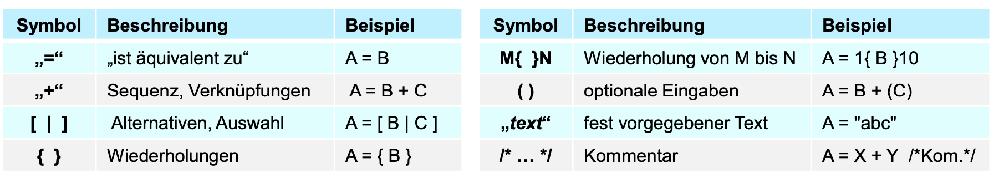

# Software Engineering

Richard Lutz (KIT) (richard.lutz@kit.edu)

## Vorlesung 05.10.2023

### Software Qualitätsmerkmale

- Performance
- Zuverlässigkeit
- Benutzerfreundlichkeit
- Funktionalität
- Fehlerfreiheit / Stabilität
- Sicherheit
- Ressourcenschonend
- Wartbarkeit
- Erweiterbarkeit
- Dokumentation
- Barrierefreiheit
- Kompatibilität
- Skalierbarkeit
- Portabilität

### Programm Möglichkeiten

- Java
- Shell
- C
- Rust

### DATA DICTIONARY Definition (WICHTIG!)

### Lastenheft

1. Zielbestimmung
   welche Ziele sollen durch den Einsatz des Produktes erreicht werden?
2. Produkteinsatz (Anwendungsbereich)
   In welchen Bereichen Wird das Produkt eingesetzt?
3. Zielgruppen, Benutzerrollen und Verantwortlichkeiten
   Wer ist am fertigen Produkt Wie involviert?
   Welche Rechte hat jede beteiligte Person?
   Wer ist wofür verantwortlich?
   Welche Kenntnisse besitzen die Endbenutzer?
4. Zusammenspiel mit anderen Systemen
   Auf welche Weise muss das Produkt mit anderen Systemen zusammenspielen?
   (Integration, Anbindung, Abhängigkeiten,
5. Verfügbarkeitsbetrachtungen
   Wann soll das Produkt oder Teile davon verfügbar sein?
6. Produktfunktionen (Basisfunktionalität, Objekte und Relationen)
   Hauptfunktionen werden aufgeführt und mit einer Zahl zur Referenzierung
   versehen (/LF10/ Lastenheft-Funktion 10).
   Nur die Hauptfunktionen interessieren, keine Details.
7. Produktdaten
   Die Daten des Produkts, die permanent gespeichert werden müssen. (/LD10/)
8. Nichtfunktionale Anforderungen (Produktleistungen)
   • Sicherheitsaspekte
   • Geschwindigkeit, Zugriffszeiten,
   • Benutzbarkeit, Benutzerfreundlichkeit
   • Datenmengen, Genauigkeit (Z.B. Rechenoperationen) (/LL10/)
9. Benutzungsoberfläche
   Erfassen und modellieren der vom Auftraggeber gewünschten Benutzeroberfläche
   • Layout, Anordnung und Anzahl der Elemente
   (Buttons, Textfelder, Tabulatoren, ...)
   • Menü- und Aufruf-Hierarchien
   • Zusammenspiel einzelner Fenster (Mufti-Frame bzw. Mufti-Window)
   • Hilfe-Strategien (kontextsensitiv, Tool Tips, Hilfefunktionen)
   • Barrierefreiheit
   Mit dem Auftraggeber zusammen Beispiele erstellen (Mockups und Szenarien)

10. Qualitätsanforderungen
    Erfassen und formulieren der Menge relevanter Qualitätsmerkmale. Hier kann
    folgende Tabelle verwendet werden (Beispiel):

11. Ergänzungen
    • Spezielle Anforderungen (Z.B. Plattform Oder Entwicklungsumgebung)
    • Durchführung spezieller Tests
    • Relevanz bestimmter Normen sowie diverse andere Aspekte