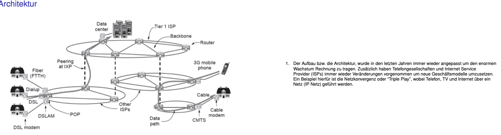

# Kommunikation & Netztechnik

## Inhalt

| Thema                  | Done | Informationen          |
|------------------------|------|------------------------|
| Einleitung             | ✓    | -                      |
| Bitübertragungsschicht | ✓    | -                      |
| Sicherungsschicht      | ✓    | -                      |
| Vermittlungsschicht    | ✓    | -                      |
| Transportschicht       | ✓    | -                      |
| Applikationsschicht    | ✓    | SMTP nicht laut Dozent |

1 DONE → Einleitung
2 DONE → Bitübertragungsschicht
3 DONE → Sicherungsschicht
4 DONE → Sicherungsschicht
5 DONE → Vermittlungsschicht
6 DONE → Vermittlungsschicht
7 DONE → Transportschicht
8 DONE → OSI und Applikationsschicht
9 DONE → Vermittlungsschicht
10 Beschreiben Sie was auf Netzwerkebene alles geschehen muss, damit eine Webseite (z.B. dhbw-
karlsruhe.de) in einem Browser eines Netzwerkgerätes angezeigt werden kann. Das Netzwerkgerät
befindet sich hinter einem NAT Gateway. Das Gateway und das Netzwerkgerät sind frisch initalisiert,
DNS und ARP Cache sind leer! In der Beschreibung sollen folgende Themen behandelt werden:
Adressierung Ethernet und IP, ARP, NAT und DNS? (10 Punkte)

## OSI-Schichtenmodell

1. Bitübertragungsschicht (Physical)
2. Sicherungsschicht (Data Link)
3. Vermittlungsschicht (Network)
4. Transportschicht (Transport)
5. Kommunikationsschicht (Session)
6. Darstellungsschicht (Presentation)
7. Anwendungsschicht (Application)

## Einleitung

- hierarchische vs verteilte Netzwerke
- 
- AUFGABEN:
    - Was wird innerhalb der heutigen Internet Architektur mit den Internetknoten (Peering at IXPs) erreicht?
        - Austausch zwischen den Netzen der ISPs (Netzbetreibern) und dem Tier 1 ISP Backbone Netz (Netz mit dem alle
          anderen Netze verbunden sind)
        - Gebühren werden von anderen Anbietern verlangt für die Netznutzung
    - Was macht die IETF und welche Dokumente werden von der IETF veröffentlicht?
        - Internet Engineering Task Force: technische Weiterentwicklung des Internets, durch Erstellung und
          Verabschiedung von Internetprotokollstandards, Beschreibungen momentan bekannter Verfahren sowie verschiedener
          Dokumente mit eher informativem Charakter. Diese Dokumente werden in Form von RFCs erstellt und umfassen unter
          anderem: IP, UDP, TCP, SCTP, HTTP
    - Wie unterscheidet sich die Paketvermittlung von der Leitungsvermittlung?
        - Leitungsvermittlung: konstanter Datenfluss über eine Leitung, Leitung ist während Übertragung blockiert
        - Paketvermittlung: Datenfluss aufgeteilt in Pakete, nicht immer alles blockiert, multiplexen, wie aktuell im
          Internet
    - Ist der Unterschied zwischen einer physikalischen Topologie und einer logischen Topologie (Overlay Netzwerk)?
        - physikalisch: Verkehrswege über Verkabelung, wirklicher Aufbau
        - logisch: Datenfluss zwischen den Endgeräten (Datenübertragung weiß nichts von physikalischem Netzwerk)
    - Wodurch unterscheiden sich Client-Server und das Peer-to-Peer Modell?
        - Client-Server: Verkehr läuft immer über einen Server, jeder Computer kann ein Server oder Client sein
          (Problem: zentralisiert)
        - Peer-to-Peer: Verkehr läuft direkt von Gerät zu Gerät, alle gleichberechtigt, jedes Gerät kann alles anbieten
          oder beanspruchen
    - Was ist ein Protokoll:
        - Ein Protokoll hält oder legt fest, zu welchem Zeitpunkt oder in welcher Reihenfolge welcher Vorgang durch wen
          oder durch was veranlasst wird.
        - Ein Kommunikationsprotokoll eine Vereinbarung, nach der die Datenübertragung zwischen zwei oder mehreren
          Parteien abläuft. In seiner einfachsten Form kann ein Protokoll definiert werden als die Regeln, die Syntax,
          Semantik und Synchronisation der Kommunikation bestimmen.
        - Protokolle können durch Hardware, Software oder eine Kombination von beiden implementiert werden. Auf der
          untersten Ebene definiert ein Protokoll das Verhalten der Verbindungs-Hardware.

## Bitübertragungsschicht

- Übertragungsmedien:
    - Leitergebunden:
        - Magnetisch
        - Lichtwellenleiter
        - Twisted Pair am Meisten verwendet, auch Koaxialkabel
    - Leiterungebunden (Drahtlos)
        - Elektromagnetisch
        - Infrarot
        - Lichtübertragung (Laser)
- Bandbreite: Kenngröße, die die Breite des Intervalls in einem Frequenzspektrum festlegt, in dem ein Signal ohne
  nennenswerte Verfremdung übertragen werden kann (in Hz gemessen/oder Bit/s)
- Shannon-Hartley-Gesetz: Cn = 2 * B (Cn = maximale Datenübertragungsrate, B = Bandbreite) (störungsfreier Kanal)
- SNR (Signal-Rausch-Verhältnis): Cs = B * ld(1+S/N) (S = Signalleistung, N = Rauschleistung, S/N = SNR)
- Multiplextechnik: mehrere Nutzsignale parallel und idealerweise ihne gegenseitig Beeinflussung auf einem gemeinsamen
  Kanal übertragen → CDMA (AUFGABE)
- AUFGABEN: 
- Digitale Modulation: Aufgaben Moodle

## Sicherungsschicht

- Aufgaben:
    - Bereitstellen einer definierten Schnittstelle zur Vermittlungsschicht
    - Behandlung von Übertragungsfehlern
    - Regulierung des Datenflusses
- Grundlegende Dienste:
    - Unbestätigter verbindungsloser Dienst:
        - kein logischer Verbindungsaufbau
        - keine Bestätigung von Frames, Verlust möglich
    - Bestätigter verbindungsloser Dienst:
        - kein logishcer Verbindungsaufbau
        - Bestätigung jedes einzelnen Frames (in höheren Schichten ineffizient, zu viele Frames müssen neu verschickt
          werden)
    - Bestätigter Verbinsungaorientierter Dienst:
        - Verbindungsaufbau vor Übertragung
        - ebenfalls Bestätigung jedes einzelnen Frames
- Umsetzung von Frames: Erkennen, wo aufhören und enden, Bitstrom aus Bitübertragunsschicht, Versenden dieser
    - Byte Count Methode: aufschreiben, wie lang einzelne Frames sind, Bits werden abgezählt im Bitstrom
    - Flag Byte Methode: Start und Ende eines Frames mit Flag Byte markiert in Bitstrom
    - Byte Stuffing Methode: vor Flag Byte ein Escape Byte setzen → dadruch werden falsche Flag Bytes erkannt (z. B. in
      Daten); auch bei Bit Stuffing möglich (Bit Muster statt Escape Byte)
    - Framing durch Codierung: Start und Ende wird durch spezielles Codewort markiert, was in Daten nie vorkommen kann
- Fehlererkennung/Fehlerkorrektur:
    - Hamming-Code: Parity Bits an Zweierpotenzstellen (1,2,4,8,16,...)
      
    - auch CRC Erkennung möglich
- Zugriff auf MAC-Adresse: mehrere Rechner teilen sich ein physikalisches Übertragungsmedium, vermeiden von
  Datenkollisionen und Datenverlust
    - Kontrollierter Zugriff: Zugriff auf Medium geregelt, dass keine Kollisionen auftreten können → Token-Ring
    - Konkurrierender Zugriff: jeder greift darauf zu, gibt Regeln, um Kollisionen behandeln zu können → ALOHA, CSMA ...

- Ethernet Frame Aufbau: 
- AUFGABEN:
    - Ziel- und Quelladresse angeben: auslesen aus Ethernet Frame (802.3 Rahmen)
    - Inhalt Type Feld angeben: z. B. bei 08 08: Frame Relay ARP
    - Wofür werden Pad Bytes benötigt? Falls Data 0 Bytes sind, dann wird Pad aufgefüllt, um 64 Byte zu erreichen, was
      die Mindestlänge eines Ethernet-Frames ist, um Kollisionen zu vermeiden (Fehlererkennung)
    - Wie groß ist der Ethernet-Rahmen insgesamt und wie groß ist der Payload? mindestens 64 Bytes, in Bsp vl nur 60
      Byte, da in Wireshark Praemble, SDF und Checksum ausgeblendet sind
    - Welche Vorteile ergeben sich beim Einsatz von Switches/Bridges? Stern Topologie wird gebildet (auf der
      Sicherungsschicht); Pakete werden nur an richtigen Port gesendet (VLans) und nicht an alle, Aufteilung eines LANs
      in unterschiedliche Kollisionsdomänen
- Data Link Layer Switching:
  
    - können auch VLANs erzeugen 

## Vermittlungsschicht

- Aufgaben
    - Zustellung von Paketen von Quelle zum Ziel (im Gegensatz zur Transportschicht läuft auf den Systemen/Routern der
      Netzbetreiber)
    - Finden geeigneter Routen durchs Netz sowie Überlastkontrolle der Routen
- Dienste:
    - verbindungslos: Routing einzelner Pakete einer Nachricht individuell und unabhängig
    - verbindungsorientiert: Beim Aufbau der Verbindung wird Route für alle Pakete einer Nachricht festgelegt und bei
      Abbau wieder gelöscht
- Routing-Algorithmen:
    - Statisch: im Vorfeld berechnet, können nicht auf spontan auftretende Ausfälle/o.ä. reagieren
    - Dynamisch: Routen werden abhängig bestimmter Messwerte berechnet und können im Betrieb geändert werden →
      Überlastkontrolle
- Einteilung: IGP (Interior Gateway Protokoll): innerhalb autonomer Systeme, Betreiber entscheidet wie Routing aufgebaut
  ist und EGP (Exterior Gateway Protokoll): unterschiedliche autonome Systeme miteinander verbinden
- Hierarchisches Routing: Aufteilung großer Netze in Regionen, pro Region ein Knoten, über Knoten läuft Kommunikation
  zwischen Regionen
- Anforderungen an Algorithmen:
    - Korrektheit
    - Einfachheit
    - Robustheit
    - Stabilität
    - Fairness
    - Effizienz
- Klassen von Routing:
    - Link State: z.B. Dijkstra (alle Nachbarn finden, Distanz finden zu Nachbarn, Paket erstellen und zu Nachbarn
      senden, alle Nachbarn machen das, kürzesten Pfad finden)
    - Distance Vector: jeder Nachbar erstellt Kostenmatrix, auffüllen eigener Matrix mit Matrizen von anderen Nachbarn,
      in Matrix steht welche Router zu welchen Kosten wie erreichbar sind
- Überlastkontrolle: wenn zu viele Pakete versendet werden über Leitung: Verlust der Pakete, dadurch werden noch mehr
  nachgesendet (verbindungsorientiert ...) (alle Rechner des Netzwerks sind daran beteiligt)
- Flusskontrolle (auf Sicherungsschicht): sorgt dafür, dass Sender Pakete nicht zu schnell für Empfänger sendet
- im Internet: IP-Protokoll (IPV4/IPV6), Pakete von a nach b verbindungslos übertragen (auch durch mehrere Netzwerke und
  Router)
- IPV4-Paket: 
    - Header und Daten
    - Time to live: Anzahl an Routern, die noch passiert werden dürfen (wenn bei 0, dann bei nächstem Router gelöscht)
    - IP Version als erste Zahl des IP-headers (4 oder 6)
- IP-Adressen: 192.168.256.123 (4 Blöcke je 3 Ziffern, auch binär darstellbar in 4 Blöcken mit je 8 Ziffern)
    - Adressklassen: A bis E (erste 4 Bits zeigen die Klasse)
    - CIDR: 195.13.132.162, Subnetzmaske: 255.255.255.224: 195.13.132.162/27
        - Netzwerkmaske, Anzahl verfügbare Adressen angeben: 
        - in welchem Netz befindet sich der folgende Host: 135.46.63.10? zur Auswahl 135.46.60.0/22, 135.46.56.0/22 →
          erste 22 Bits müssen übereinstimmen in binär, also alle 3 Hosts umwandeln und vergleichen → hier ist es
          135.46.60.0/22
        - Netzwerkadresse, Broadcast-Adresse, erste IP und letzte IP-Adresse und die Anzahl möglicher IP-Adressen
          angeben:
            - 149.81.141.229/28: 2^32/2^28 - 2 = 2^4 - 2 = 16 - 2 = 14 mögliche Adressen
            - Broadcast-Adresse: letzte 4 Bits auf 1 setzen → 11101111 → 149.81.141.239
            - Netz-Adresse: letzte 4 Bits auf 0 setzen → 11100000 → 149.81.141.224
            - erste IP: Netzadresse + 1 → 149.81.114.225; letzte IP: Broadcast-Adresse -1 → 149.81.141.238
            - Netzmaske: letzte Bits (je nach Anzahl hier 4) auf 0 setzen, also wie bei Netz-Adresse

- NAT: Router verwaltet Netz aus eigenen IP-Adressen (Heimrouter)
    - DNAT: Verbindung kommt von außen, Port muss geöffnet werden, damit Router weiß, wo Paket intern hin muss (z. B.
      HA)
    - SNAT: Verbindung kommt von innen, Router weiß von wem und wohin
    - Vorteile: IP-Adressen vor anderen Geräten in Netz verborgen, Sicherheit; Problem der knappen IP-Adressen umgehen
    - Nachteile: heben strenge Trennung des OSI-Schichtenmodells auf, Ende zu Ende wird durch NAT Router unterbrochen
    - AUFGABE:
        - Netzwerkaufbau:
            - Ein Gerät im Netz:
                - IP Adresse: 192.168.1.104
                - Netzmaske: 255.255.255.0
                - Default Gateway: 192.168.1.1
                - Default DNS-Server: 192.168.1.1
                - MAC Adresse: 80:E6:50:17:A9:E0
            - Öffentliche IP-Adresse des zentralen NAT Gateways: 87.144.84.120; MAC: 84:9C:A6:19:F6:95
        - Broadcast Adressen finden Ethernet und IP: Ethernet = FF:FF:FF:FF:FF:FF; IP = 192.168.1.255 (da Netzmaske
          0 hinten)
        - Ethernet-Frame:
            - Quelle: FINDEN => MAC des Gerätes, also 80:E6:50:17:A9:E0
            - Ziel: FINDEN => MAC des Routers, also 84:9C:A6:19:F6:95
            - darunter liegendes IP-Paket: Quelle: 192.168.1.104, Ziel: 80.110.158.9
        - Wie werden Quelle und Ziel umgeschrieben, wenn das IP-Paket das lokale Netz verlässt?
            - Quelle wird zu Router und Ziel bleibt gleich
        - Wie lauten Quell- und Zieladressen eines Antwortpakets vor und hinter dem NAT?
            - außerhalb NAT → Quelle: Server, Ziel: NAT-Gateway; innerhalb NAT → Quelle: Server, Ziel: Gerät
- ARP: IP-Adressen werden in MAC-Adressen umgewandelt (senden von Ethernet Frame als Broadcast Meldung mit Mac Adresse
  FF:FF:FF:FF:FF:FF an alle Geräte in Netz, enthält IP, die gesucht wird; wenn ein Empfänger die IP-Adresse bei sich
  findet, sendet dieser ARP Antwort an Sender zurück; gefundene MAC-Adresse wird in ARP-Cache des Senders gespeichert,
  Cache dient zur schnelleren Namensauflösung)
- ICMP: Informations- und Fehlermeldungen werden ausgetauscht (senden von Router an Quelle, enthalten Type und Code
  Fehld, sowie Header und die ersten 8 Bytes des IP Pakets, das für die Generierung der ICMP Nachricht verantwortlich
  war)
    - Ping: Erreichbarkeit einer IP-Adresse (Type 8, Code 0 an spezifizierten Rechner; Empfänger antwortet mit Type 0,
      Code 0)
    - Traceroute: Route von Quelle zu Ziel aufzeigen (versenden von IP-Datagrammen an unübliche Port-Adresse; enthalten
      TTL, jeder Punkt auf Route, der bisher abgelaufen wurde, erhöht TTl; wenn TTL zu groß, dann antwortet ein Router
      mit nicht gefunden)
- Pfad MTU: finden des "Flaschenhalses" in einem Netzwerk, bei dem die maximale Größe eines Datenpakets nicht mehr
  vorbeikommen kann. Wenn einer gefunden wird, wird eine ICMP Nachricht zurückgesendet, dadurch kann Sender Pakete
  mit passender Größe versenden, um Flaschenhals zu vermeiden
- OSPF: offenes Protokoll mit dem jeder seinen eigenen Routing Algorithmus schreiben kann
-

## Transportschicht

- Aufgaben:
    - Transport von Paketen von Quelle zum Ziel (im Gegensatz zur Vermittlungsschicht direkt auf Rechnern der Benutzer)
    - Logischer Transport, dadurch weiß die Anwendung nichts von der Technik, die darunter liegt
    - Segmente (diese Schicht), Pakete und Frames (von darunter liegenden Schichten)
- Diensttypen:

| Verbindungsorientierte (TCP)                       | verbindungslose (UDP)                         |
|----------------------------------------------------|-----------------------------------------------|
| zuverlässig                                        | weniger zuverlässig                           |
| langsamer                                          | schneller                                     |
| Pakete können nachgefordert werden => kein Verlust | Pakete nicht nachforderbar => Verlust möglich |

- Sockets: dienen der Adressierung (Portnummer) und als Schnittstelle der Transportschicht im Internet
- Typen von Ports:

| Dynamische Ports               | Well Known Ports/Registered Ports                       |
|--------------------------------|---------------------------------------------------------|
| Client Ports                   | bestimmten Protokollen zugeordnet                       |
| dynamisch bei Bedarf allokiert | Registered Ports bei Bedarf aber auch selbst verwendbar |
|                                | verwaltet von IANA                                      |

- TCP Verbindungsaufbau:
    - Control Segment mit gesetztem Syn Flag senden, zusätzlich wird zufällige Syn-Sequenznummer erzeugt
    - Bestätigen mit Syn/Ack Control Segment (gesetztem Syn und Ack Flag), zusätzlich wieder eine
      Syn/Ack-Sequenznummer (Syn-Sequenznummer(x)+1 und neue Sequenznummer(y): zufällig)
    - Antwort darauf wieder mit Ack-Segment (mit eigener Sequenznummer(x)+1 und Ack-Sequenznummer(y)+1)
- TCP Verbindungsabbau:
    - beide Parteien müssen sich darauf einigen
    - beide Parteien senden FIN-Segment, sowie je eine Antwort ACK
    - sollten keine ACK_Segmente zurückkommen, nach mehreren versuchen aufgeben und Verbindung einseitig beenden
- TCP Typen von Segmenten:
    - Control Segmente: Steuerinformationen (wie Ack/Syn/Fin)
    - Payload Segmente: Nutzdaten aus höheren Schichten und deren Steuerdaten
- UDP hat keinen direkten Verbindungsaufbau, Pakete werden einfach gesendet

## Applikationsschicht

- Domain statt IP-Adresse
- Domain wird von IP-Adresse entkoppelt (bei Änderung der IP immer noch über Domain auffindbar)
- 
- Jede Domain bekommt einen (Domain resource) record
- Domain Resource Record: Domain_name, Time_to_live, Class, Type, Value
- Typen:
    - SOA: Information für Name Server Zone (welche Domains werden von diesem Server verwaltet)
    - A: für IPV4-Adressen
    - AAAA: für IPV6-Adressen
    - NS: Nameserver für Domain/Subdomains spezifizieren
    - CName: Zweitnamen/Alias für Rechner
    - PTR: Reverse-Look-Up (gibt Domain zurück)
    - SPF: (PTR) schaue ob IP für EMail hinterlegt ist
    - MX: (CName) Rechner für EMails
    - SRV: Rechner für spezifische Aufgaben in Domain für EMail
    - TXT: beliebige Text Werte hinterlegen

- Domain Server - Abfrage Hierarchie
    - 
    - Root-Server: gibt Auskunft über IP der TLD-Server
    - TLD-Server: gibt Auskunft über IP der Nameserver
    - Autoritative Nameserver: für Zone zuständig
    - Sonstige Nameserver: Caches
