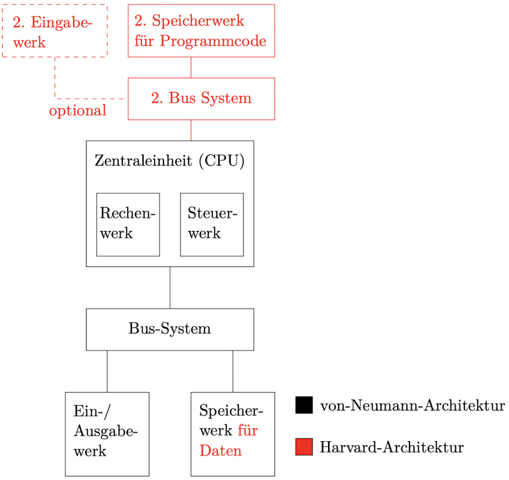
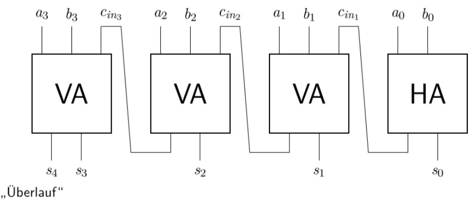
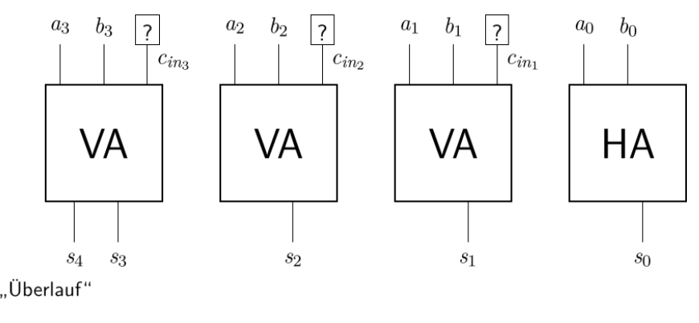
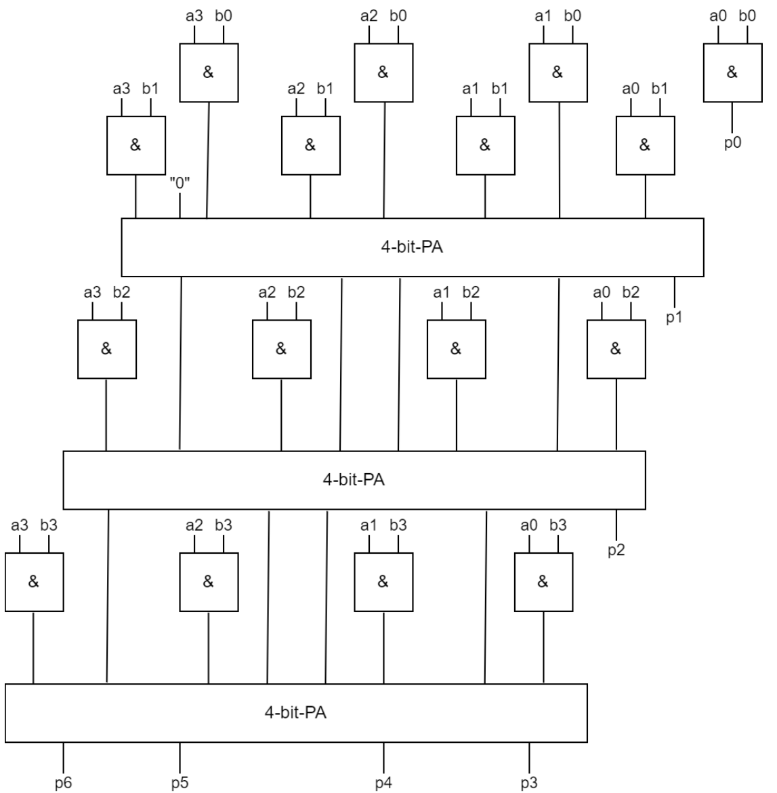
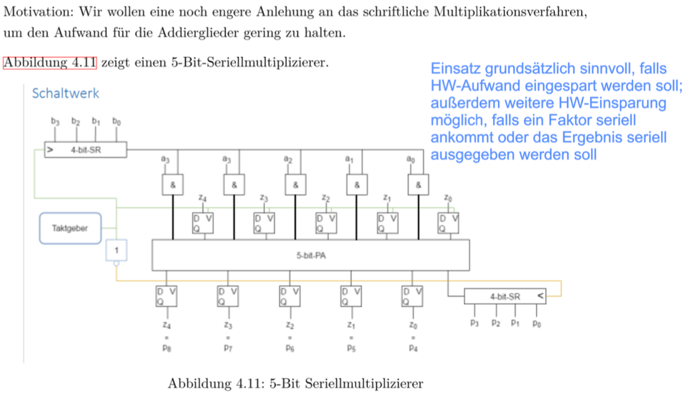
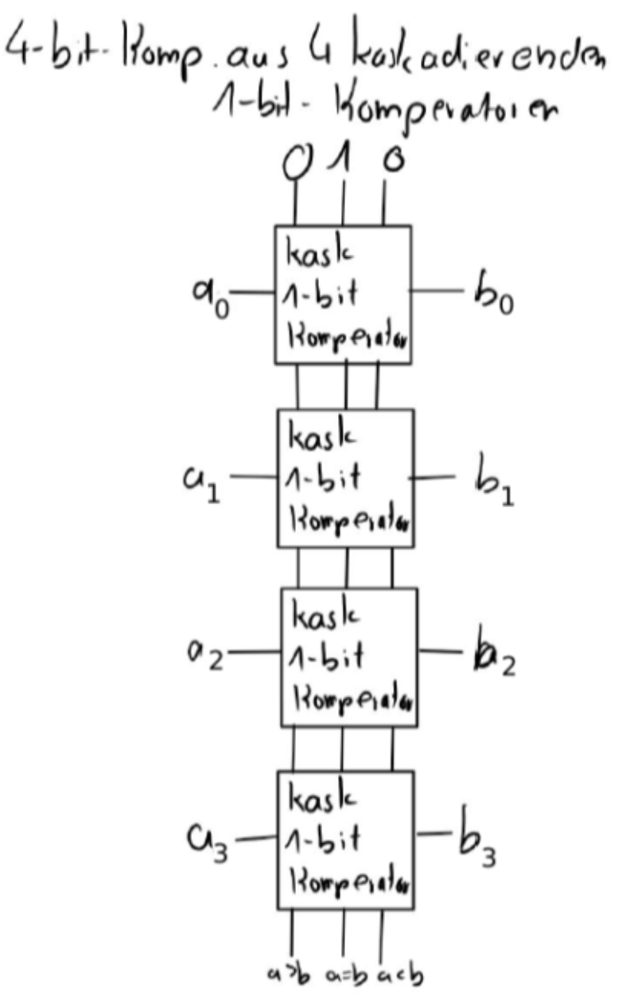
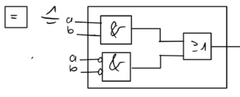
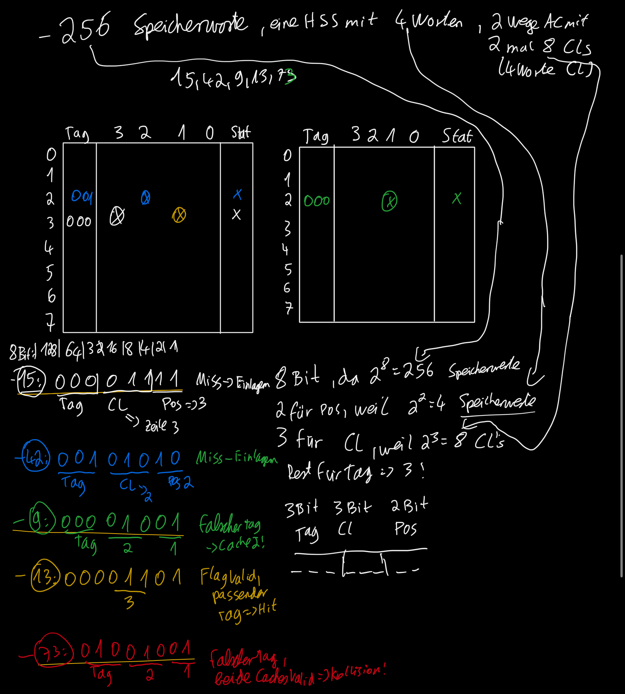

# Rechnerarchitektur

### 4 Aufgaben, 60 Minuten, 50 Punkte, 23 zum bestehen

## Aufgabe 1

- Rechenwerk: Durchführen von Rechnungen mit numerischen und logischen Werten
- Steuerwerk: Interpretation des Programmcodes und Koordination aller Werke
- Speicherwerke: Vorhalten von Nutzdaten und Programmcode gleichermaßen ohne konzeptionelle Trennung der beiden Arten
  von Informationen
- Eingabewerk: "logische" Schnittstelle zu Eingabegerät z. B. USB-Controller
- Ausgabewerk: "logische Schnittstelle" für Ausgabegeräte z. B. Grafikkarte
- Bus: Verbindet alle Komponenten und ermöglicht den Informationsaustausch/Datenfluss zwischen ihnen

Unterschiede Aufbau: Harvard-Architektur weißt klare Trennung von Programmcode und Nutzdaten auf, was bei der Neumann
Architektur gleich gehalten wird

| Architektur | Vorteile                                                                                                                                                                                             | Nachteile                                                                                                                                                                                 |
|-------------|------------------------------------------------------------------------------------------------------------------------------------------------------------------------------------------------------|-------------------------------------------------------------------------------------------------------------------------------------------------------------------------------------------|
| von-Neumann | universelle Programmierbarkeit flexible Speicheraufteilung zwischen Programmcode und Daten kostengünstig, einfache Updates von Programm und Betriebssystem                           | Virenanfälligkeit => Nutzdaten können als Programmcode ausgeführt werden möglicher Flaschenhalt Bus und Speicherwerk                                                              |
| Harvard     | nahezu immun gegen absichtlichen Virenbefall keine unabsichtlichen Änderungen am Betriebssystem möglich bessere Performance möglich durch gleichzeitigen Zugriff auf beide Speicherwerke | komplexer und teurer durch mehr Hardware schwer update-fähig, ohne zweites Eingabewerk keine Möglichkeit anderen Programmcode auszuführen unflexible Aufteilung des Speichers |

Anwendungsfälle beider Architekturen:

- von-Neumann: übliche PC-Architektur (Universal PC)
- Harvard: embedded systems (zB. in Waschmaschinen, Smartphones etc), Bestandteile von PCs (BIOS, CPU-Cache)

## Aufgabe 2

- Halbaddierer: Addition zweier einstelliger Binärzahlen a und b zu einer zweistelligen Binärzahl s (Summe) und cout
  (Übertrag) → Hardwareaufwand: 8 Transistoren (Anzahl Eingänge)
- Volladdierer: Addition von drei einstelligen Binärzahlen a, b und cin (Übertrag vorher) zu einer zweistelligen
  Binärzahl s (Summe) und cout (Übertrag) → Hardwareaufwand: 2*HA + 2 = 18 Transistoren

Paralleladdierer (RC-PA, CLA-PA) → hier auch Aufwand

- RC-PA: mehrstelliger Addierer für Binärzahlen
- CLA-PA: Der cin Eingang wird nicht von vorausgehendem Volladdierer oder Halbaddierer übernommen, sondern durch
  magisches CLA Schaltnetz nachberechnet → besserer Zeitaufwand
- Beispiel Skizze (4 Bit, a3a2a1a0 + b3b2b1b0 = s4s3s2s1s0 => s4 ist Überlauf):

- Aufwand: RC-PA läuft hintereinander (für embedded systems, da weniger Hardware), CLA-PA nebeneinander (cla-pa für
  CPUs, da schneller)
- Hardwareaufwand: RC-PA - 18n-10; CLA-PA - n*4^n
- Zeitaufwand: RC-PA - 2n Gatterlaufzeiten; CLA-PA - 4 GLZ

Multiplizierer aus Paralleladdierern (seriell, parallel)

- Multiplikation mit Paralleladdierer:
    - 16 UND-Gatter und 3 4-Bit Paralleladdierer
    - 
- Multiplikation seriell
    - 5 UND-Gatter, 2 Schieberegister, 1 Taktgeber, 10 D-FF
    - 

## Aufgabe 3 und Aufgabe 4

### Komparatoren

- Vergleich zweier binärer Zahlen von links nach rechts, Rechenwerk muss wissen welche Zahl größer oder
  gleich ist, Cache will wissen ob Zahlen gleich oder nicht
- 4 stelliger Komparator Skizze:

- Aufwand des Komparators:
  - Hardware: 18 Transistoren (Allgemein: 18*n)
  - Zeit: 2 GLZ (Allgemein: 2*n GLZ)
- Komparator im Cache (Gleichheit):

### Cache

- temporärer, flüchtiger, schneller Zwischenspeicher, um auf Informationen aus dem Hauptspeicher schneller
  zugreifen zu können.
    - Eigenschaften:
        - kleiner als das zu cachende Medium (Hauptspeicher)
        - schneller als das zu cachende Mediun
        - transparent → es wird nicht auf den Cache zugegriffen, sondern auf das zu cachende Medium logisch
          zugegriffen (Adressierung des Hauptspeichers)
        - konsistent → alle Instanzen derselben Hauptspeicheradresse (HSA) haben denselben Wert
        - kohärent → beim Zugriff auf eine HSA wird immer der aktuelle Wert geliefert

| Architektur /Arbeitsweise | Erläuterung                                                                                                                              | Vorteile                                                               | Nachteile                                                                                                                          |
|---------------------------|------------------------------------------------------------------------------------------------------------------------------------------|------------------------------------------------------------------------|------------------------------------------------------------------------------------------------------------------------------------|
| Look-Aside-Architektur    | CPU, Cache, Speicher über einen Bus verbunden Anfrage durch CPU geht an beide (schnellere Antwort gewinnt)                           | Zugriffszeit bei einem Miss wie ohne Cache => immer beste Zugriffszeit | Bus braucht Zugriffsprotokoll mit Overhead (langsamer als 1:1 Verbindung) Konsistenz durch zweite Antwort potentiell gefährdet |
| Look-Through-Architektur  | Cache mit CPU und Speicher einzeln verbunden aber nicht Cache mit Speicher,  CPU greift über Cache auf Speicher zu                   | optimale Konsistenz                                                    | Zugriffszeit bei Miss höher als ohne Cache                                                                                         |
| Write-Back-Strategie      | Schreibzugriff durch die CPU findet im Cache statt,  Cache aktualisiert die Daten bei nächster Gelegenheit im Hauptspeicher.         | Schreiben in Cache Geschwindigkeit                                     | zeitweilige Inkonsistenz der Daten                                                                                                 |
| Write-Through-Strategie   | Schreibzugriff durch die CPU findet im Speicher statt,  parallel dazu Daten in Cache invalidiert oder müssen auch geschrieben werden | optimale Konsistenz der Daten                                          | Schreiben nur in Speicher Geschwindigkeit möglich                                                                                  |

- Kombinationen:

| Cachearchitektur | Write-Back                                                                                                                          | Write-Through                                                                   |
|------------------|-------------------------------------------------------------------------------------------------------------------------------------|---------------------------------------------------------------------------------|
| Look-Through     | gut, physische Geschwindigkeit vorhanden um direktes Schreiben  in Cache und Rückschreiben vom Cache in Speicher zu ermöglichen | nicht möglich, da kein direkter Zugriff der CPU auf Speicher gegeben (physisch) |
| Look-Aside       | schlecht, da Bus bei jedem Schreiben zweimal belastet wird                                                                          | gut, da Schreibzugriffe parallel im Speicher und Cache gut physisch machbar     |

- Verdrängung: Bei Einlagerung einer Hauptspeicherseite (HSS) im Cache muss eine andere aus dem Cache entfernt werden.
  Eine Kollision ist Voraussetzung für Verdrängung. Verdrängungsstrategie entscheidet, welche HSS verdrängt wird
  → Strategien:
    - Optimale: Verdrängung HSS welche gar nicht mehr oder am längsten nicht mehr gebraucht wird (Aufwand: nicht
      möglich, man weiß nie, was man nicht mehr braucht; Zweck: Realisierung für Benchmarking, zwei Durchläufe mit genau
      denselben Parametern, erster Durchlauf Logfile, zweiter Durchlauf mit optimaler Strategie anhand Logfile)
    - LRU: Least-Recently-Used, Verdrängung HSS, auf welche am längsten nicht mehr zugegriffen wurde (Aufwand: Timestamp
      mit Update bei jedem Zugriff, Suche zu aufwendig)
    - LFU: Least-Frequently-Used, Verdrängung HSS, die bisher am wenigsten genutzt wurde (Aufwand: Benutzungszähler,
      Einlagerungszähler; Häufigkeit = Zugriffe / Zeit, Suche und Berechnung aufwändig)
    - Zufällig: zufällige Auswahl (Aufwand: Zufallsgenerator, Zweck: Benchmarking)
    - FIFO: Verdrängung HSS, welche am längsten im Cache ist (Aufwand: Timestamp in jeder CL, Suche nach dem Minimum der
      Timestamps, sehr aufwendig; Verwaltung der CLs als Liste mit Zeigern auf Nachfolger → weniger aufwendig)

- Arten Caches:
    - voll-assoziativ:
        - jede HSS in jede CL einlagerbar (ein Komparator für jede CL)
        - Kollisionen erst wenn der Cache voll ist (hot)
    - direct-mapped:
        - für jede HSS genau eine CL, in die diese eingelagert werden kann (ein Komparator für ganzen Cache)
        - Kollisionen ab zweitem Zugriff möglich
    - n-Wege-assoziativ:
        - für jede HSS genau n Cache Lines, in welche diese eingelagert werden kann (Realisierung über n DMC, n
          Komparatoren)
        - Kollisionen ab n+1 Zugriff möglich

- Ihr System besitzt einen Hauptspeicher mit 256 Speicherworten, linear adressiert beginnend mit der Adresse ”0”, eine
  Hauptspeicherseite umfasst 4 Worte und benutzt einen 2-Wege-Assoziativ-Cache mit zwei mal 8 Cachelines (4-wortige
  Cacheline). Nacheinander wird auf die Hauptspeicheradressen dezimal 15, 42, 9, 13 und 73 zugegriffen. Erläutern Sie im
  Verlauf der Zugriffe insbesondere, ob es sich bei dem jeweiligen Zugriff um einen Hit oder einen Miss handelt.
  Skizzieren Sie im Folgenden Diagramm Cachebelegungen nachdem diese Zugriffe stattgefunden haben und machen Sie
  deutlich, wo konkret die zugehörigen Worte mit diesen Hauptspeicheradressen im Cache liegen!

