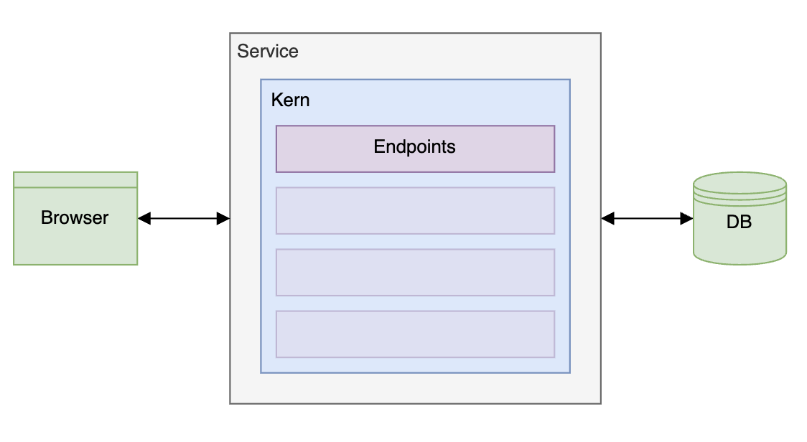
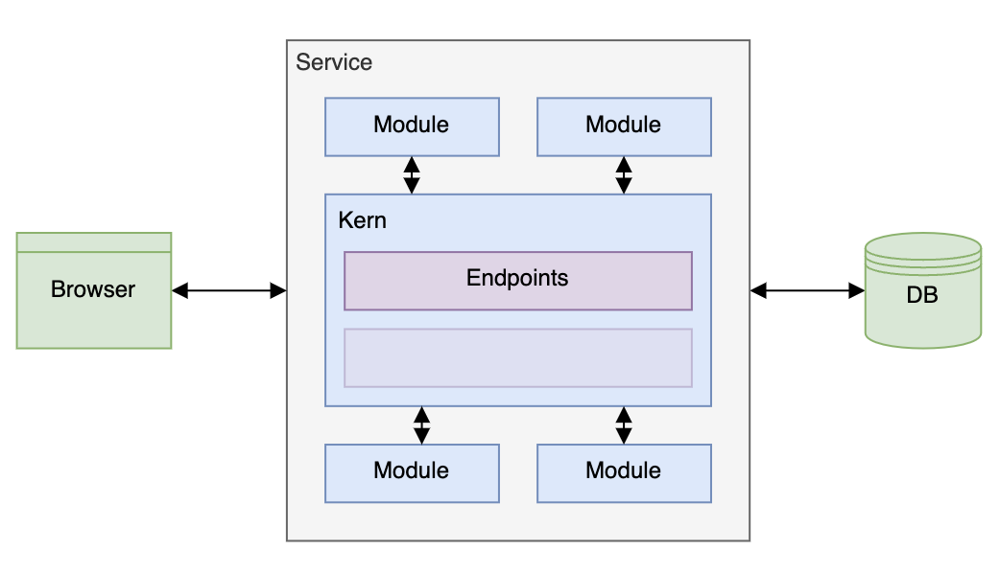
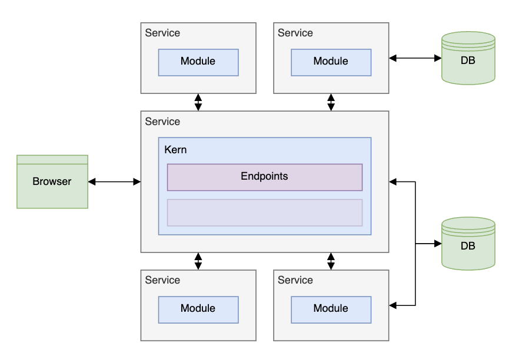
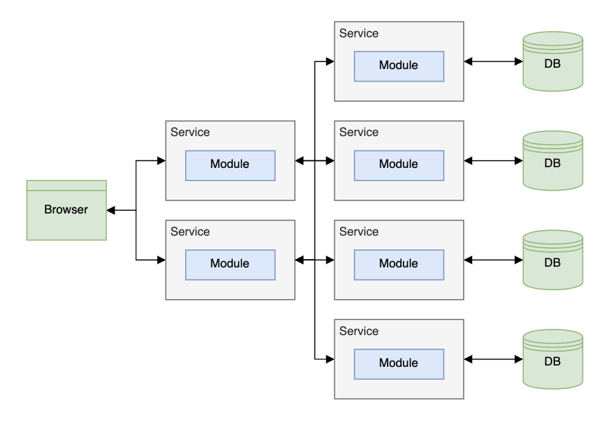
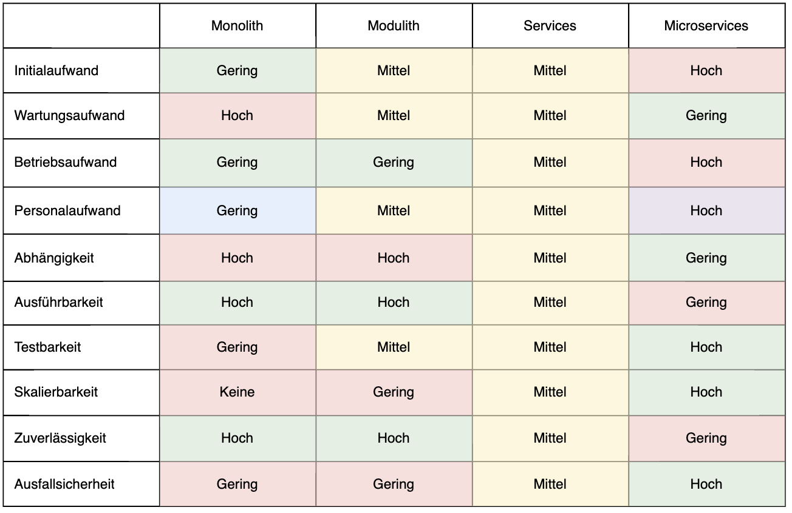
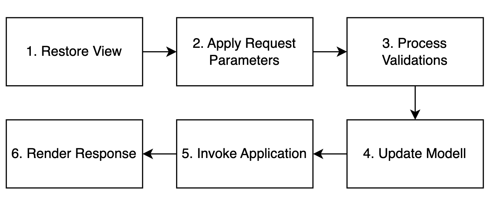
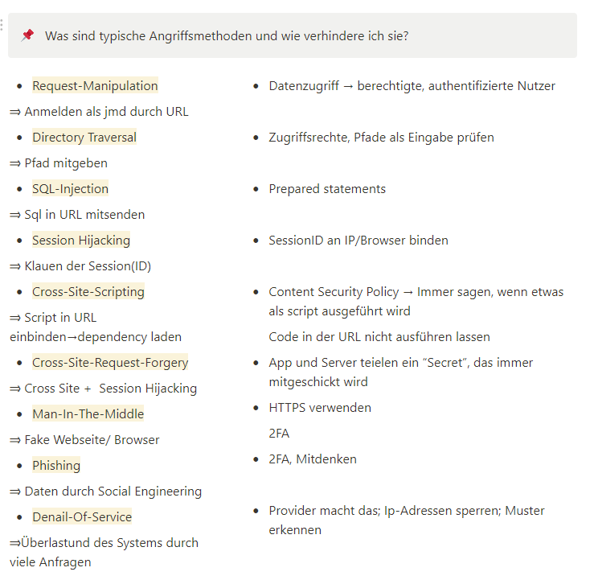

# Web Engineering 2

## JS Themen:

- Callbacks
- XML HTTP Request
- Promises
- Async/Await
- Spring

## 1 Ajax in Plain JavaScript (asynchrones JS und XML)

- Daten anzeigen, ohne eine neue HTML-Seite zu laden (DOM-Manipulation)
- Callbacks: übergeben einer Funktion (Callback) an eine andere Funktion, welche den Callback später aufruft/ausführt

| Synchron                                                     | Asynchron                                      |
|--------------------------------------------------------------|------------------------------------------------|
| Ausführung von Code in strikter Reihenfolge                  | keine vorgegebene Reihenfolge                  |
| es muss auf jeden Programmschritt/Aufruf gewartet werden     | muss nicht gewartet werden                     |
| Programmschritte können NICHT gleichzeitig ausgeführt werden | gleichzeitige Ausführung möglich (nicht in JS) |

- Event Loop in Browsern führt Code asynchron aus → JavaScript an sich kann es nicht, aber mithilfe des Browsers ist
  es dann doch möglich
- Daten von Servern abrufen: XML HTTP Request an Server
- Promises: Machen aus Callback wieder "regulären" Rückgabewert, sie versprechen, dass der Wert irgendwann existiert →
  vermeiden Callback Chaos
- Async/Await mit Promises: Async markiert asynchronen Code, mit Await warten wir auf das Ergebnis des Async Codes

## 2 Single Page Application (SPA)

→ dazu auch die Sequenzdiagramme aus den Slides können

- Eine JavaScript-Web-Applikation, die exakt eine Seite laden muss, um komplett zu funktionieren
- Webseite wird komplett geladen beim ersten Aufruf, dann in der Runtime Daten vom Server abgerufen, welche dann durch
  JS gerendert werden
- Warum?
    - Reduktion übertragender Daten
        - Stylesheets: einmalige Auslieferung
        - JS: ebenfalls repetitiv, auf mehreren Seiten dieselben Funktionen
        - HTML: dynamischer Teil beschränkt auf Informationen, Rest einmalig lieferbar
    - Bessere UX
        - kürzere Antwortzeiten
        - weniger BE Requests nötig und währenddessen nutzbar
        - asynchrones Nachladen der Informationen
    - Weniger Serverresourcen
        - Rendering und Geschäftslogik auf Client
        - Server kümmert sich nur um Daten
    - Session Clientseitig
        - Service kann stateless sein
        - Skalierbarkeit einfacher
        - Loadbalancing einfacher, da Session nicht verschoben werden muss → ist auf Client
    - Hybride Anwendungen auch mobil einsetzbar
        - ähnlich wie Apps
        - keine Doppelentwicklungen
        - React/Flutter...
- Nachteile:
    - erstes Laden langsamer
    - Search Engine Optimization schwerer (Daten werden erst in der Runtime geladen)
        - JS muss ausgeführt werden, oft nicht unterstützt oder benachteiligt → serverseitiges Rendering?
    - Client nicht vertrauenswürdig
        - JS Code könnte manipuliert werden, erneute Validierung nötig (→ dadurch Folgepunkte)
    - duplizierter Code
    - höherer Entwicklungsaufwand
- theoretisch kein Routing nötig, aber um Links zu sharen gibt es Pseudo-Routing

## 3 Rich Client Server

- Webserver:
    - Stateless: kein Zustand, Session, nur Daten
    - Scalable: abhängig von ausschließlich externen Informationen, dynamisches Hoch-/Runterfahren
    - Untrusting: Validierung und Isolierung aller Eingaben, durchgehende Prüfung der Authorisierung
- Architekturen:
    - Aufteilung von Verantwortlichkeiten
    - Abgrenzung einzelner Komponenten
    - Interaktion zwischen Komponenten

→ keine detaillierten Erklärungen, nur wissen, dass es da verschiedene Formen gibt

| Monolith                                    | Modulith                                                                              | Services                                 | Microservice                                                            |
|---------------------------------------------|---------------------------------------------------------------------------------------|------------------------------------------|-------------------------------------------------------------------------|
| Alle Aspekte der Anwendung in einem Projekt | Unterteilung der ANwendung in Fachlichkeiten (Auslagerung in Modulen/Package/Projekt) | Modulith als Kern                        | Auslagerung jedes Moduls in Services                                    |
| keine Trennung zwischen Fachlichkeiten      | Module definieren öffentliche Schnittstellen                                          | Auslagerung einzelner Module in Services | Expliziter Kern durch implizite Abhängigkeiten zwischen Services erstzt |
| keine externen Abhängigkeiten zur Laufzeit  | Keine Auslagerung zur Laufzeit                                                        | Services haben eigene Datenhaltung (DBs) | Services replizieren Daten in eigener Datenhaltung                      |
|                                             | zusammengeführt durch Kern                                                            |                                          |                                                                         |
|             |                                                       |          |                                    |

- Vergleich Architekturen
  
- Anforderungen und Teamgröße limitieren jeweils Architekturmöglichkeiten
- Architektur aus Deckung der Architekturmöglichkeiten wählen
- Teamgröße muss sich mit Anforderung decken
- Fazit: Monolith fpr unbekannte Projekte, Modulith für mehr Wartbarkeit, Services für Skalierbarkeit, Microservices für
  Zuverlässigkeit
- Spring-Boot:
    - Application Framework, Dependency-Injection-Container
    - Schichten: Frontend (Nutzeroberfläche), Middleware (implementiert Businesslogik), Backend (Persistente Ebene,
      andere Services) → das ist wichtig (egal welche Architektur, es gibt immer diese 3 Punkte)
    - Informationen zum Programmieren in Folien

## 4 Rich Client React

- SPA in Plain JS:
    - exzessives Einsetzen von Ajax
    - Nachteile: sehr aufwendig, viel Boilerplate Code (immer wieder dasselbe)
- React:
    - unterstützt bei DOM Manipulation und Routing
    - Change Detection
- Funktionen in React:
    - enthalten Information und Logik zum Rendern des UI
    - Mischung aus JS und HTML
    - BSP:
      export default functiob ReactFunction() {
      const name = 'World';
      return 
Hello {name}!

      }
- React Routing:
    - einfache Navigation
    - automatische Anpassung der URL
- Laden dynamischer Daten mit der Library Axios (axios.get(...))
- React Hooks (reagiert auf alle Parameter im Array, nicht nur state Änderungen):
    - Speichern von State (mit useState()) (Speichern/Ändern von Daten in einer React Funktion)
    - Lifecycle: useEffect() (Seiteneffekte für React Funktionen; Callback, welcher zu bestimmten Zeitpunkten aufgerufen
      wird)
- Component Architecture
    - Teilen der Webseite in einzelne Komponenten → Verteilung und Strukturierung der Komplexität
    - Komponenten enthalten zusammengehörige Funktionalität, haben feste Schnittstellen (modular einsetzbar, Parameter
      rein und raus) und abstrahieren Struktur und Styling (Bsp für Komponenten: Button, Google Anzeige für Shops)
      → React Funktionen sind Komponenten (kann Parameter entgegennehmen und über Callback einen Wert zurückgeben)
    - Vorteile:
        - Konsistenz im Styling
        - Wiederverwendbarkeit
        - Schnellere Entwicklung
        - Einfacherer Instandhaltung
    - Nachteile:
        - Tiefe Verschachtelungen möglich
- Atomic Design → viele kleine Bausteine bauen großes ganzes zusammen (Webseite)
    - Strukturierung und Kategorisierung von Komponenten
    - ordnet Komponenten nach Atomen (Buttons, Text, usw), Molekülen (Suchleiste, Form Gruppen), Organismen (Header,
      Footer, Overlays), Templates (Schablonen), Pages (konkrete Seiten)
    - Storybook Funktion in React lässt Komponenten in verschiedensten Ausprägungen ansehen
- Micro Frontends
    - bringt Ordnung und Struktur
    - Aufteilen des Frontends in mehrere Frontends, die einfach zusammengesteckt werden können

## 5 Rich Client React Testing

- Test Pyramide:
    - manuelle/automatisierte End to End Tests
        - manuelle oder automatisierte Tests
        - Testen über das richtige UI
        - Testen der gesamten Software
        - Styling erfordert manuelle Tests
        - Lange Laufzeit (besonders manuelle Tests mit Menschen)
    - Integration Tests
        - automatisierte Tests
        - Testen zusammenhängender Teile der Anwendung (ein einzelner Backendservice etc.)
        - weniger Detailtiefe, Fokus liegt auf wichtigen Szenarien, interessanten Edge Cases oder Fehlern, die
          aufgetreten sind
        - etwas längere Laufzeit
    - Unit Tests
        - automatisierte Tests
        - Testen der kleinsten Einheiten auf sehr detaillierter Ebene mit einer kurzen Laufzeit
- Wieso Unit-Tests? übersichtlich, test driven development, Komponenten vielseitig einsetzbar, lebende Dokumentation
- Wie schreiben wir Unit-Tests? Isolation Komponente (z. B. Dependency Injection), Schnittstellen und Childkomponenten
  werden gemockt
- Wie schreibe ich gute Unit-Tests?
    - Logik testen
    - dynamisches Rendering
    - weitere JS Logik
- Wie sollten wir eine Komponente testen? Nutzer interagieren mit Buttons und Textfeldern, nicht mit JS Funktionen, am
  besten End to End
- Sauberer Aufbau:
    - Schema folgen
    - Sätze bilden
    - Testbeschreibung als lebende Doku
    - wenig Duplikate
    - jeder Test eine Sache testen → im Fehlerfall schnell erkannt
    - Code Duplikate in Tests vermeiden mit beforeEach Funktionen
    - Tests müssen reproduzierbar sein (nicht aktuelles Datum verwenden)
- Unit-Tests in React
    - React Testing Library
    - Funktionen: Render, screen, fireevent, jest.fn (mocken), jest.mock (Imports mocken), waitfor (async Code)
    - Routing muss im Test vorhanden sein (Navigate mocken)
    - Assertions in waitfor möglich, Aufrufe verifizierbar

## 6 Rich Client React Redux

KOMMT NICHT DRAN, DA WIR ES NICHT GEMACHT HABEN!!!

→ was sind states, warum müssen wir die managen?

- Was ist State Management? State Management bezieht sich auf die Verwaltung des Zustands (State) einer Anwendung
  während ihrer Lebensdauer. Der Zustand umfasst alle Daten, die den aktuellen Zustand der Benutzeroberfläche, die Daten
  der Anwendung und andere relevante Informationen beschreiben. In Webanwendungen wird der Zustand oft durch Variablen
  oder Objekte repräsentiert und kann sich während der Benutzerinteraktion oder aufgrund von Datenänderungen ändern.
- Was ist Redux? Redux ist eine JavaScript-Bibliothek für das State Management in Webanwendungen, insbesondere in
  React-Anwendungen. Redux implementiert das Konzept des unidirektionalen Datenflusses und speichert den Zustand der
  Anwendung in einem einzigen Store. Die Änderungen am Zustand werden durch sogenannte "Actions" ausgelöst, die von "
  Reducers" verarbeitet werden. Redux erleichtert die Verwaltung des Zustands in großen Anwendungen und fördert einen
  klaren und vorhersehbaren Datenfluss.
- Wozu braucht man State Management? State Management ist wichtig, um den Zustand einer Anwendung effizient zu
  verwalten. In komplexen Anwendungen kann der Zustand viele verschiedene Teile der Benutzeroberfläche und der Daten
  umfassen. Ein gutes State Management sorgt dafür, dass Daten konsistent und zuverlässig aktualisiert werden, reduziert
  unerwartete Seiteneffekte und erleichtert die Wartung der Anwendung.
- Wie baue ich Redux in mein React-Frontend ein? Redux-Store erstellen, Reducer Funktionen erstellen, Provider verwenden
  um Redux-Store in React-Anwendung zu integrieren, Komponenten mit Redux verbinden

## 7 Jakarta Server Faces

→ Sessionscopes, Abgrenzung JSF zu JSP wichtig, wo ist da SpringBoot

Jakarta Server Faces (JSF) ist ein Java-Web-Framework, das die Entwicklung von Benutzeroberflächen für
Java-Webanwendungen erleichtert. JSF gehört zu den Java Enterprise Edition (Java EE) Technologien und wird jetzt unter
dem Dach der Eclipse Foundation als Jakarta EE weiterentwickelt.
Hier sind einige wichtige Merkmale von Jakarta Server Faces:

- Komponentenbasiertes Framework: JSF ist ein komponentenbasiertes Framework, was bedeutet, dass es die
  Benutzeroberfläche in wiederverwendbare Komponenten aufteilt. Entwickler können benutzerdefinierte Komponenten
  erstellen und wiederverwenden, um die Anwendung zu strukturieren. Es gibt z. B. Definitionen für Navigation,
  Listeners, Beans etc
- Managed Beans: JSF verwendet sogenannte "Managed Beans", um die Logik und den Zustand der Anwendung zu verwalten.
  Diese Beans können Informationen zwischen den Ansichten (Views) und dem Backend speichern.
  Definierbar über Annotationen oder die faces-config.xml; es gibt verschiedene Scopes, in denen das Bean gilt
- Event-Driven Programming: JSF setzt auf ereignisgesteuerte Programmierung. Aktionen wie Benutzerinteraktionen führen
  zu Ereignissen, die vom Framework behandelt werden können. Zum Beispiel kann ein Button-Klick ein Ereignis auslösen,
  das eine Methode in einem Managed Bean aufruft. (Application oder System Events)
- Fester Lebenszyklus (Lifecycle): JSF hat einen festen Lebenszyklus für die Verarbeitung von Anfragen und die
  Aktualisierung der Benutzeroberfläche. Dieser Lebenszyklus ermöglicht es dem Framework, die Anfrage des Benutzers zu
  verstehen und die Benutzeroberfläche entsprechend zu aktualisieren.
   → wichtig
- Schritte:
    - **Restore View (Wiederherstellung der Ansicht):**
      In dieser Phase wird die JSF-Ansicht wiederhergestellt, das bedeutet, der Zustand der Benutzeroberfläche wird
      wiederhergestellt. Dabei wird überprüft, ob es sich um eine neue Anfrage handelt oder ob es sich um eine teilweise
      Anforderung handelt.
    - **Apply Request Values (Anwenden der Anforderungswerte):**
      In dieser Phase werden die vom Benutzer eingegebenen Werte aus dem Request-Objekt auf die entsprechenden
      Komponenten der Benutzeroberfläche angewendet.
    - **Process Validations (Validierungsprozess):**
      Hier werden die Werte der Benutzeroberfläche validiert. Das beinhaltet die Überprüfung von Benutzereingaben auf
      Gültigkeit, wie z.B. Überprüfung von Datumsformaten oder numerischen Werten.
    - **Update Model Values (Aktualisierung der Modellwerte):**
      Nach der Validierung werden die Werte in das zugrunde liegende Datenmodell aktualisiert. Wenn die Validierung
      erfolgreich ist, werden die Werte auf die zugehörigen Backing-Beans oder andere Datenmodelle übertragen.
    - **Invoke Application (Anwendungsaufruf):**
      In dieser Phase werden die Methoden aufgerufen, die mit den Aktionen auf der Benutzeroberfläche verknüpft sind.
      Zum Beispiel werden hier die Methoden aufgerufen, die in der Backing-Bean definiert sind und die mit Schaltflächen
      oder Links verknüpft sind.
    - **Render Response (Antwort rendern):**
      Schließlich wird in dieser Phase die Antwortseite für den Benutzer generiert und gerendert. Der Zustand der
      Benutzeroberfläche wird wieder in die Ausgabe-HTML-Seite geschrieben, und diese wird dem Benutzer zurückgesendet.

Es ist wichtig zu beachten, dass diese Phasen im JSF-Lebenszyklus nicht immer linear durchlaufen werden. Je nach Aktion
des Benutzers oder Ereignissen in der Anwendung kann der Lebenszyklus unterschiedlich sein. Auch können bestimmte Phasen
übersprungen oder mehrmals durchlaufen werden, abhängig von den Anforderungen der Anwendung.

- Templating: JSF unterstützt die Verwendung von Templates, was die Möglichkeit bietet, das Layout und das Design der
  Anwendung zu standardisieren. Templates können verwendet werden, um gemeinsame Strukturen auf verschiedenen Seiten zu
  definieren.
- Integration mit anderen Technologien: JSF kann gut mit anderen Java-EE-Technologien integriert werden, wie z.B.
  Enterprise JavaBeans (EJB), Java Persistence API (JPA) und anderen.
- Navigation enteder explizit oder implizit → Unterschied erklären, wie die je funktionieren
    - wenn in faces-config.xml definiert, dann explizit, wie es dort definiert wurde
    - wenn nicht, dann implizit, es wird immer an die Adresse geroutet, die im Return der Funktion steht
- Zusätzliche Interfaces: → Unterschied Validator und Converter erklären können
    - Converters
        - Konverter für gängige Datentypen und Einheiten
    - Events and Listeners
    - Validators
        - Standard-Validator für gängige Datentypen
- JSF-Tags:
    - wie HTML-Tags, bloß eigene in JSf, z. B. \<h:form>

Die Entwicklung von Jakarta Server Faces wurde unter dem Namen JavaServer Faces (JSF) bei der Java Community Process (
JCP) gestartet. Nach dem Übergang von Oracle zu Eclipse wurde es als Jakarta Server Faces Teil des
Jakarta-EE-Projekts. Es ist wichtig zu beachten, dass Jakarta EE den Platz von Java EE eingenommen hat, nachdem Oracle
die Rechte an den Java-Trademarks an die Eclipse Foundation übergeben hat. Daher wird Jakarta Server Faces als Teil
des Jakarta-EE-Ökosystems weiterentwickelt.

## 8 Authentifizierung

→ Also bei allen Punkten hier immer die Unterschiede kennen und vl Beispiele und wie das je funktioniert

- Zugriffstypen: → Unterschiede kennen
    - Discretionary Access Control (DAC):
        - jeder Nutzer kann Rechte für ein Objekt einzeln einstellen
    - Mandatory Access Control (MAC):
        - System gibt Rechte vor, anpassbar, aber System hat mehr Rechte
- Access Control Typen: (Unterschiede wissen)
    - Identitätsbasiert
    - Rollenbasiert
    - Attributbasiert
- Authentifizierungsfaktoren:
    - Wissen: Passwort, Sicherheitsfragen (Nutzer Schwachstelle, Transportweg des Passworts zu Server unsicher,
      Datenbank Leak)
    - Besitz: Security-Token, Smart Card (Verlust)
    - Inhärenz: Biometrische Verfahren (nicht eindeutig genug, um praxistauglich und sicher zugleich zu sein)
- Authentifizierungsarten:
    - direkt: Daten direkt bei Anwendung, möglicherweise mehr Daten zum Login erforderlich
    - über dritten Anbieter: Daten sind der Anwendung unsichtbar, aber beide müssen dem Drittanbieter vertrauen
- Multifaktor:
    - erhöht Sicherheit enorm
    - 2 unterschiedliche Authentifizierungsfaktoren
    - gängig: OTP/TOTP, SMS, Smart Cards
    - Generierung nicht auf gleichem Gerät wie Login-Gerät
- Probleme in der Praxis:
    - HTTP zustandslos → Zustand nötig → Session
    - Cookies oder URL-Rewriting (beides Vor-/Nachteile)
    - Verteilte Anwendungen (mehrere Instanzen): Nutzer kann bei nicht optimierten Anwendungen Zugriff im Betrieb
      verlieren (bei Instanz Wechsel → Load Balancing)
        - Nutzerbindung an Instanz
        - Sessions werden Instanz übergreifend gespeichert
        - Session Gateway, oder tokenbasiert beim Nutzer
- Formen der Authentifizierungsforms:
    - HTTP Basic Authentication:
        - Browser stellt Formular bereit, Server authentifiziert (username:password), Form nicht editierbar
    - Form based Authentication:
        - Formular von Anwendung
        - Anwendung entscheidet über Zugang
        - bessere Fehlerbehandlung
    - Protokolle: SAML (hat ebenfalls einen Identity Provider, wo die Session gespeichert wird), OAuth2 (bei beiden ein
      Identity Provider, automatischer Login ohne Passwort, SSO Zugriff auf Ressourcen, OAuth2 gibt Access und
      Refreshtokens)
    - SessionStorage nicht nutzen, da von jedem Fenster darauf zugegriffen werden kann (unsicher) → lieber in Cookies
- Authorisation: Zugriff auf Ressourcen
- Authentication: stellt sicher, dass der Nutzer auch wirklich der ist für den er sich ausgibt
- Verschlüsselung: Public (Verschlüsseln) und Private (Entschlüsseln) Key (erklären können, dass es 2 Schlüssel gibt,
  Unterschied Verschlüsselung und Signaturverfahren)
- Signaturverfahren: Prüft ob Nachricht verändert wurde; Verschlüsselungsverfahren: verhindert Zugriff auf
  Nachrichteninhalt (RSA)
- JSON Web Token:
    - von AUTH0, Libraries vorhanden
    - Token hat 3 Teile: Hash Algorithmus Typ, Payload Daten, Hash aus ersten beiden Teilen + Secret
    - Token Lifecycle: JWT mit Header, Payload von Autorisierungsserver bestückt, Token wird signiert an Client
      gesendet, Client sendet Token an Anwendung, Anwendung prüft Token mithilfe des Secrets

## 9 Security

- Datendiebstahl/-veränderung, Computersabotage/-betrug
- Größere Webanwendungen meist attraktive Ziele
- Nachteile:
    - konkurriert mit Benutzbarkeit
    - höhere Entwicklungskosten
    - komplexere Architektur
    - höherer Ressourcenverbrauch
- Security ist Qualitätsanforderung, je nachdem, wie sicher und wertvoll eigene Daten sind
- viele Arten der Angriffe (genaue Definition auf Folien) => Definition lernen und je die Abwehrmaßnahme
    - Request Manipulation
    - Directory Traversal
    - SQL-Injection
    - Session Hijacking
    - Cross-Site-Scripting
    - Cross-Site-Request-Forgery
    - Man-in-the-Browser/-Middle
    - Phising
    - Denial-of-Service (DDoS)
      
- Abwehrmaßnahmen:
    - Serverseitige Daten verschlüsseln, validieren und nicht interpretieren
    - HTTPS
    - 2FA
    - Whitelisting statt Blacklisting
    - Minimalprinzip
    - Sicherheitsmaßnamen nicht ausschalten
    - Aktualisieren von Abhängigkeiten
    - Weiterbildung der Nutzer
- Data Mining
 
