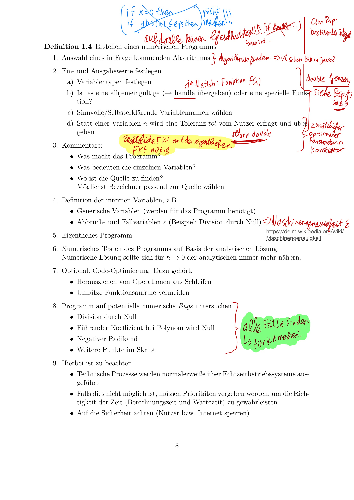
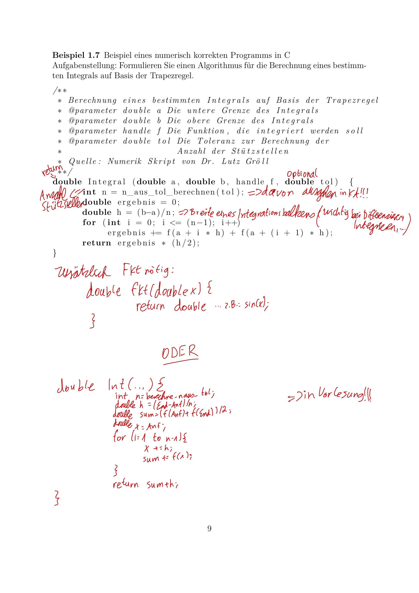

# Zusammenfassung Numerik

## Einleitung

#### Zusammenfassung

- Numerik ist die Implementation von Algorithmen. Im Allgemeinen werden in den Algorithmen die Ergebnisse nur
  angenähert, aber so weit, dass diese praktikabel sind.
- Fehlerarten:
    - Eingabefehler: Eingaben sind fehlerhafte Messwerte (Messfehler, etc) oder Ergebnisse aus vorangegangenen
      fehlerhaften Berechnungen
    - Rundungsfehler: Rundungen in oder vor dem Algorithmus
        - Computer kann in Variablen Gleitkommazahlen nur bis gewisser Länge darstellen. Um das zu vermeiden, kann man
          mehr Speicher pro Variable verwenden oder bessere Algorithmen (Seite 3)
        - Änderung der Reihenfolge der Berechnungen in einem Algorithmus kann das Ergebnis ändern (aber nur in der
          Numerik → andere Zwischenschritte mit vl weniger Nachkommastellen und deswegen weniger Rundungsfehlern)
        - Beispiel ist die Berechnung von √2 - 1,42 = fast 0 in Numerik, da nicht alle Stellen von √2 gespeichert werden
          können → schlecht konditionierte Matrix geht mit hoher Fehlerverstärkung einher → falsche Ergebnisse (Seite
          4, Mitte)
    - Verfahrensfehler: Abstand der Ergebnisse des exakten und angenäherten, numerischen Algorithmus
        - bessere Algorithmen (effizienter) können Ergebnisse verbessern (zum Beispiel bei numerischen Integrieren:
          anstelle Riemann die Simpson Regel verwenden; Pivotisierung beim Gauß-Algorithmus; QR-Zerlegung beim
          Least-Square-Problem)
- Kondition und Stabilität eines Algorithmus: Gegeben sind eine exakte Funktion und ein angenäherter Algorithmus. Auch
  gibt es genaue und gerundete Eingaben:
    - f(gerundete Eingabe) - f(exakte Eingabe) = Kondition
    - Alg(gerundete Eingabe) - f(exakte Eingabe) = Stabilität
    - beide addiert
    - Stabilität: Kleine Fehler in den Eingaben oder Rundungsfehler wirken sich nicht so stark auf das Ergebnis aus,
      also wie stark schwankt der numerische Algorithmus bei Störung?
    - Kondition: Probleme mit guter Kondition (es geht um die Aufgabenstellung), also wie stark schwankt das Problem
      (die exakte Funktion) bei Störung (fehlerhaften Eingaben)?
- Konditionszahl berechnen:
    - |Ableitung(f(x)) * x/f(x)| => f(x) ist das analytische Problem
    - <a href="https://de.wikipedia.org/wiki/Korrekt_gestelltes_Problem">Wichtig in Wikipedia</a>
- Kondition einer Matrix: (A = Matrix)
    - für singuläre Matrizen: K(A) = unendlich
    - für reguläre Matrizen: K(A) = Norm der Matrix * Norm der Inverse der Matrix

!!!MATRIX SACHEN NOCH ANSCHAUEN SEITE 6, 7

- Erstellen eines numerischen Programms:
  
  

#### Mögliche Aufgaben

- Wann werden Integrale in der Numerik verwendet? (heißt Annäherung an exakte Funktion)
    - Wenn die Funktion nur als Wertetabelle gegeben ist
    - Wenn die Funktion nicht analytisch notierbar ist (mit elementaren Funktionen wie sin, ...)
    - Wenn der Ausdruck für die analytische Funktion zu kompliziert ist
    - Wenn es sich um Oberflächenintegrale oder Raumintegrale handelt
- Pseudocode schreiben, der den Flächeninhalt/bestimmtes Integral berechnen kann (mit Riemann, Trapez oder Simspon,
  siehe Seite 2 oder Kapitel Numerisches Integrieren)
- kolineare Probleme: haben eine hohe Empfindlichkeit und dadurch eine hohe Fehlerverstärkung. Rundungsfehler können
  schnell entstehen, vermeidbar siehe oben
- Beispielaufgabe zu Konditionszahl in Skript auf Seite 5 unten

## Grundarithmetik

## Komplexität von Algorithmen

## Numerisches Differenzieren

## Numerisches Integrieren

- Seite 2 oben interessant

## Numerisches Lösen von Differenzialgleichungen

## Numerisches Lösen nicht linearer Gleichungssysteme

## Numerische Optimierungsverfahren